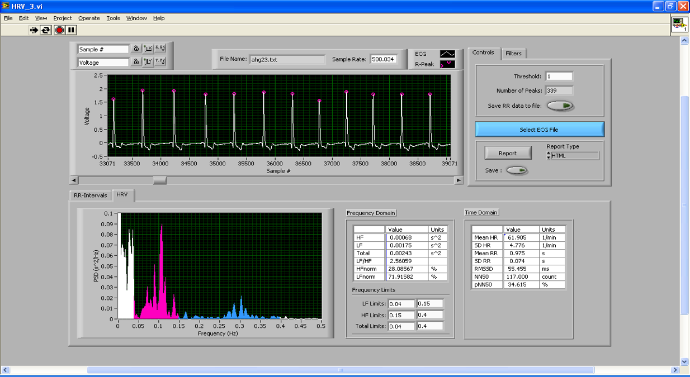

## Description

LabVIEW UI that can read ECG signals from text files, filter signal, detect beats, extract RR/IBI, and perform simple HRV analysis.

## Install/Setup

Requires LabVIEW. Simply download the repository and run the main VI.

## Contact Info

John T. Ramshur, PhD  
jramshur@gmail.com  
LinkedIn: [http://www.linkedin.com/in/johnramshur](http://www.linkedin.com/in/johnramshur)  
Blog: [http://www.johnramshur.com](http://www.johnramshur.com)

Project was part of my Masters thesis while at:

Joint Program in Biomedical Engineering  
[University of Memphis](http://www.memphis.edu/bme/)  
[University of Tennessee Health Science Center](http://www.uthsc.edu/bme/)
Advisor: Amy de Jongh Curry, PhD

## License

GNU General Public License 3.0
